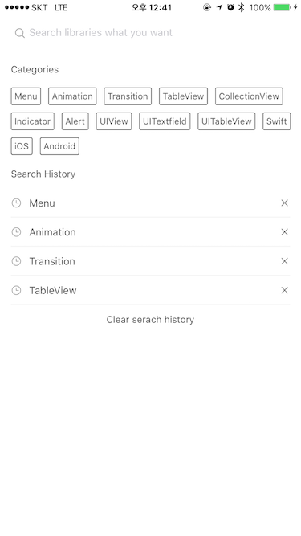

# YNSearch
[](http://cocoapods.org/pods/YNSearch)
[](https://github.com/Carthage/Carthage)
[](http://cocoadocs.org/docsets/YNSearch)
[](https://github.com/younatics/YNSearch/blob/master/LICENSE)
[](http://cocoapods.org/pods/YNSearch)
[](https://developer.apple.com/swift/)

## Updates
See [CHANGELOG](https://github.com/younatics/YNDropDownMenu/blob/master/CHANGELOG.md) for details

## Intoduction
Awesome search view, written in Swift 3, appears search view like Pinterest Search view. You can fully customizable this library.





## Requirements

`YNSearch` written in Swift 3. Compatible with iOS 8.0+

## Installation

### Cocoapods

YNSearch is available through [CocoaPods](http://cocoapods.org). To install
it, simply add the following line to your Podfile:

```ruby
pod 'YNSearch'
```
### Carthage
```
github "younatics/YNSearch"
```

## Simple Usage
Set database(Required), categories(Required) and search histories(Optional).
```swift
import YNSearch

let demoDatabase = ["Menu", "Animation", "Transition", "TableView", "CollectionView", "Indicator", "Alert", "UIView", "UITextfield", "UITableView", "Swift", "iOS", "Android"]

ynSearch.setDatabase(value: demoDatabase)
ynSearch.setCategories(value: demoDatabase)
ynSearch.setSearchHistories(value: demoDatabase)

self.ynSearchinit()
```
Done!

## View Hierachy
```
YNSearchViewController: Inherit this viewcontroller 
|-- YNSearchTextFieldView: YNSearchTextField with cancel button
|   |-- YNSearchTextField: Search UITextfield
|   |-- cancelButton: Show when YNSearchTextField textFieldDidBeginEditing
|
|-- YNSearchView : get both YNSearchMainView and YNSearchListView
|   |-- YNSearchMainView: First view that you can see
|   |   |-- categoryLabel: Cateogry label
|   |   |-- [YNCategoryButton]: cateogory buttons
|   |   |-- searchHistoryLabel: Search history label
|   |   |-- [YNSearchHistoryView]: history views
|   |   |   |-- [YNSearchHistoryButton]: Search history button
|   |   |   |-- [closeButton]: Close button
|   |
|   |-- YNSearchListView: UITableview with search result
```

## Custom Usage
set `YNSearchDelegate` if you want callback
```Swift 
self.delegate = self

func ynSearchHistoryButtonClicked(text: String) {
  print(text)
}
    
func ynCategoryButtonClicked(text: String) {
  print(text)
}
    
func ynSearchListViewClicked(text: String) {
  print(text)
}
```

Set `YNCategoryButton` type.
```Swift
self.ynSearchView.ynSearchMainView.setYNCategoryButtonType(type: .colorful)
```

#### You can fully customizable this `YNSearch` based on view hierachy

## References
#### Please tell me or make pull request if you use this library in your application :) 

## Author
[younatics 🇰🇷](http://younatics.github.io)

## License
YNDropDownMenu is available under the MIT license. See the LICENSE file for more info.
